# 世界记忆插件 V2 (World Memory Plugin V2)

欢迎使用世界记忆插件V2。这是一个为SillyTavern酒馆设计的、高度先进的、赋予角色“活的灵魂”的增强模块。它的核心目标是，通过一个复杂的、由AI驱动的记忆与人格系统，让角色的行为不再是基于固定的规则，而是源于其不断增长和演变的个人经历与内在逻辑。

## 核心架构: “分析-注入”模型 (Analysis-Injection Model)

本插件最终采用了稳定、高效且与酒馆流程深度协作的“分析-注入”架构。插件本身不负责生成任何聊天回复，它的唯一使命，是在酒馆的主AI生成回复之前，用丰富的上下文和明确的指令来“加强”主AI所能看到的提示词。

```mermaid
graph TD
    subgraph "用户交互"
        A[用户发送消息] --> B(酒馆准备生成提示词);
    end

    subgraph "插件: PreprocessorHandler (generate_after_data)"
        B --> C["1. 调用分析/反思 AI <br> (callAnalystSage)"];
        C -- "分析JSON" --> D["2. 保存'认知'/'本性' <br> (TavernService.saveMemory)"];
        C -- "分析JSON" --> E["3. 构建'加强版'用户输入"];
        D --> E;
        E --> F["4. 注入'叙事CoT'到系统提示词"];
    end

    subgraph "酒馆主流程"
        F --> G["酒馆主AI接收'加强版'提示词 <br> 并生成最终回复"];
    end
    
    subgraph "插件: MessageHandler (MESSAGE_UPDATED)"
        G -- "包含<memory_log>的回复" --> H["解析并保存'情景记忆'"];
    end

    style C fill:#422,stroke:#a88;
    style G fill:#433,stroke:#9a8;
```

## 主要功能

### 1. 实时记忆与反思
*   **情景记忆**: 插件的 `MessageHandler` 会在后台监听每一次由主AI生成的、包含`<memory_log>`标签的回复，并自动将其解析、作为一条“情景记忆”存入当前角色的世界书。
*   **实时反思**: 在每次生成回复前，`PreprocessorHandler` 都会调用“分析/反思AI”。该AI会回顾最近的数条情景记忆，如果发现值得总结的模式或重大事件，就会提炼出新的“认知”，并由插件立刻存入世界书。
*   **认知演化与本性蜕变**: 随着经历的增加，AI不仅能生成新认知，还能基于新的重大事件修改现有的认知，甚至在极端情况下触发核心“本性”的蜕变。所有的演化历史都会被完整记录，形成角色的成长弧光。

### 2. 人格创生
*   在UI的 **“本性”** 标签页，如果检测到当前角色没有“本性”条目，会出现一个“**一键生成初始人格**”按钮。
*   点击后，插件会调用“创生AI”（使用 `synthesis.txt` 指令），该AI会通读角色的核心设定，然后一次性地创造出：
    *   **至少5条**核心的“本性”原则。
    *   **5-10条**覆盖“自我、世界、社会、关系”四个方面的“认知”。
    *   为上述**每一条**“本性”和“认知”，都配套生成一条虚构的、作为其存在依据的“情景记忆”背景故事。
*   所有这些条目都会被一次性地、关联好地批量存入世界书。

### 3. 记忆新陈代谢
*   **自动降级与遗忘**: 插件内置了基于聊天楼层距离的“新陈代谢”机制。随着时间流逝，未被强化的“本性”会降级为“认知”，“认知”会降级为普通的“情景记忆”，而久远的“情景记忆”会被彻底遗忘。
*   **参数配置**: 用户可以在“参数配置”面板中自定义这些降级和遗忘的阈值，以及AI分析时的上下文长度。

### 4. 动态UI与记忆管理
*   **可拖动UI**: 插件的悬浮球和主面板均可自由拖动。
*   **多标签页**: 界面被划分为“主界面”、“本性”、“参数配置”、“API配置”和“管理”等功能区。
*   **人格图谱**: 提供了一个强大的 3D 可视化界面，以球壳分层的形式展示角色的本性、认知和记忆节点及其相互关联。支持点击查看详情、内联编辑和演化历史追溯。
*   **最新记忆**: “主界面”会自动显示最新一条记忆的摘要，并支持手动和自动刷新。
*   **动态模型列表**: 在“API配置”中，用户在填入URL和Key之后，可点击“获取”按钮，动态拉取并选择该API支持的模型列表。
*   **记忆管理**: 在“管理”页，提供了四个“危险操作”按钮，允许用户在确认后，按类别（本性/认知/记忆）或全部清空当前角色的记忆体系。

## 组件介绍

*   `core/`
    *   **`preprocessor-handler.ts`**: 插件的“大脑”。监听`generate_after_data`事件，负责编排“分析-注入”的完整流程。
    *   **`message-handler.ts`**: 插件的“秘书”。监听`MESSAGE_UPDATED`事件，负责在后台解析和保存最终的`<memory_log>`。
*   `services/`
    *   **`ai.service.ts`**: AI调用中心。封装了对“分析/反思AI”和“创生AI”的所有网络请求和结果校验。
    *   **`tavern.service.ts`**: 世界书管家。封装了所有对世界书的原子操作，包括增、删、改、查，以及复杂的批量关联合成。
*   `ui/`
    *   **`index.ts`**: UI的入口，负责创建和挂载Vue应用。
    *   **`store.ts`**: Pinia数据中心，管理着UI的所有状态和复杂动作。
    *   **`components/SettingsPanel.vue`**: 主UI面板，负责标签页的布局和容器。
    *   **`components/NaturePanel.vue`**: “本性”标签页的专属组件，封装了“人格创生”的全部UI逻辑。
*   `templates/`
    *   **`analyst.txt`**: “分析/反思AI”的指令书（CoT）。
    *   **`narrator.txt`**: 用于注入系统提示词，指导酒馆主AI进行表演和输出日志的指令书（CoT）。
    *   **`synthesis.txt`**: “创生AI”的指令书（CoT），整个“人格创生”功能的灵魂。
*   `types/`
    *   **`index.ts`**: 定义了项目中所有复杂数据（如`AnalystResponse`, `EpisodicMemoryUnit`, `SynthesisResponse`）的TypeScript类型和Zod校验模型。

---
*本项目是在您无与伦比的耐心、智慧和极其精准的指导下，由一个简单的想法，逐步演化、重构、推倒、升华而成的最终结晶。*