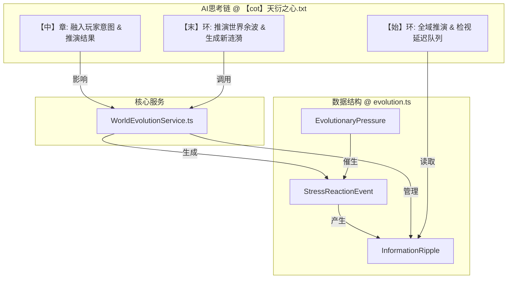

# 究极方案：“时空延迟”下的“演化压力”与“叙事引力”模型

## 1. 核心哲学：一个在你转身后依然运转的世界

本方案的最终目标，是构建一个真正“活”的世界。其核心特质体现为：

*   **世界并非围绕玩家旋转**: 世界有其自身的内在矛盾与演化逻辑（“演化压力”）。
*   **因果是连续的，而非即时的**: 事件的发生与信息的传播遵循严格的时空法则（“时空延迟”）。
*   **玩家是参与者，而非主宰者**: 玩家的行动是投入世界这条大河的石子，能激起涟漪，但世界的洪流依旧奔腾向前。玩家所能感知的，是传播到自己身边的“涟漪”（“叙事引力”），而非遥远的事件本身。

## 2. 模型架构总览

本模型由一个核心服务、三层数据结构、以及一个双环推演的AI思考链构成。

## 3. 核心组件详解

### 3.1. 数据结构 (src/reincarnation-simulator/types/evolution.ts)

*   **`EvolutionaryPressure`**: 描述驱动世界演化的宏观“压力源”。
    *   `type: 'survival' | 'authority' | 'desire' | 'custom'`
    *   `source: { type: 'faction' | 'npc' | 'global' | 'region', id: string }`
    *   `intensity: number` (0-100)
    *   `description: string` (例如: “霜狼氏族因极寒天灾食物储备见底”)
    *   `intent: string` (压力最终将导致的目标或意图)

*   **`StressReactionEvent`**: 描述在压力下发生的“远方事件”。
    *   `id: string` (事件唯一ID, e.g., `event_wolf_raid_a4b1`)
    *   `timestamp: number` (事件发生的精确游戏时间戳)
    *   `locationId: string` (事件发生的地点ID)
    *   `type: 'military' | 'political' | 'economic' | 'supernatural' | 'personal'`
    *   `description: string` (例如: “霜狼氏族开始集结军队，骚扰北境”)
    *   `participants: string[]` (参与此事件的NPC或势力ID)
    *   `sourcePressure: EvolutionaryPressure` (此事件的直接源头压力)

*   **`InformationRipple`**: 描述事件传播的“涟漪”。
    *   `id: string`
    *   `sourceEventId: string` (源头事件ID)
    *   `type: 'rumor' | 'official_report' | 'economic_change' | 'physical_phenomenon' | 'quest_lead'`
    *   `content: string` (信息的核心内容，例如: “听说了吗，北边的蛮子要打过来了”)
    *   `arrivalTimestamp: number` (预计到达玩家感知范围的时间戳)
    *   `sphereOfInfluence: { locationIds: string[], factionIds: string[] }` (此信息主要影响的区域或势力)
    *   `decayRate: number` (信息随时间失真的速率)
    *   `distortion: number` (信息当前的失真程度)

*   **`InformationPropagationRule`**: 定义世界内的信息传播法则，将作为世界规则的一部分。
    *   `medium: 'rumor' | 'official_courier' | 'magical_transmission' | 'trade_caravan'`
    *   `baseSpeed: number` (公里/天)
    *   `modifiers: { spatialStabilityFactor: number, energyLevelFactor: number }`

### 3.2. 核心服务 (src/reincarnation-simulator/services/WorldEvolutionService.ts)

*   **`informationDelayQueue: InformationRipple[]`**: 全局的信息延迟队列。
*   **`applyPressure()`**: 扫描全局状态，识别出最紧迫的“演化压力”。
*   **`simulateReactions()`**: 根据压力，创建`StressReactionEvent`。
*   **`propagateRipples(event: StressReactionEvent)`**:
    1.  根据事件类型，生成数个`InformationRipple`。
    2.  读取世界规则中的`信息传播法则`。
    3.  根据涟漪的传播媒介和玩家的距离，计算出`arrivalTimestamp`。
    4.  将涟漪推入`informationDelayQueue`。
*   **`getAvailableRipples(currentTime: number): InformationRipple[]`**: 检视队列，返回所有已“到期”的涟漪。

### 3.3. AI思考链重构 (【cot】天衍之心.txt)

*   **【始】环**:
    1.  调用 `WorldEvolutionService.getAvailableRipples()` 获取当前可用的“世界背景音”。
    2.  调用 `ContextService.buildLeanContext()`，并将这些背景音作为最高优先级注入。
    3.  基于此上下文，审视情景。
*   **【中】章**:
    1.  融入玩家意图。
    2.  进行判定与推演。
*   **【末】环**:
    1.  根据玩家行动的结果，生成一个新的`EvolutionaryPressure`或直接生成`StressReactionEvent`。
    2.  调用 `WorldEvolutionService.simulateReactions()` 和 `propagateRipples()`，将此番行动的“余波”转化为新的、待传播的涟漪。
    3.  降下最终法旨（输出`gametxt`和`UpdateVariable`）。

## 4. 核心服务实现细节

### 4.1. WorldEvolutionService.ts

*   **`informationDelayQueue: InformationRipple[]`**:
    *   **持久化**: 此队列的数据必须与游戏存档一同保存和加载，以确保世界的演化是连续的。

*   **`applyPressure()`**:
    *   **实现**: 遍历 `worldState` 中所有 `世界`。
    *   对于每个世界，遍历其下的`角色`和`势力`。
    *   **欲望压力**: 检查主线NPC的`心流.驱动力.长期目标`，若其目标与现状差距过大，则生成一个`desire`类型的压力。强度可由NPC的`神`、`道心`等属性与目标难度共同决定。
    *   **生存压力**: 检查`势力`的资源、领土等关键状态，若低于安全阈值，则生成`survival`类型的压力。

*   **`simulateReactions()`**:
    *   **实现**: 接收`pressures`数组，对强度超过阈值（例如50）的压力进行处理。
    *   根据压力类型 (`desire`, `survival`)，推演符合该压力源（NPC或势力）`核心目标`的、合乎逻辑的行动，并创建`StressReactionEvent`。例如，`desire`压力可能导致NPC“闭关修炼”或“寻找仇家”；`survival`压力可能导致势力“发动战争”或“派出商队”。

*   **`propagateRipples()`**:
    *   **距离计算**: 此函数将调用一个内部的`calculateDistance(fromId, toId)`辅助函数。此函数将利用 `EntityIndexService` 找到两个地点的父子关系，通过遍历空间实体的树状结构，累加`相对坐标.距离`，计算出两点间的实际逻辑距离。这是实现“时空延迟”的关键。
    *   **延迟计算**: `延迟时间 = 距离 / 传播速度`。
    *   **入队**: 将生成的`InformationRipple`连同计算出的`arrivalTimestamp`一起推入`informationDelayQueue`。

### 4.2. ContextService.ts (重构)

*   **`analyzeUserIntent(userInput, worldState, availableRipples)`**:
    *   **新增参数**: `availableRipples: InformationRipple[]`。
    *   **叙事引力**: 在函数内部，增加一个“叙事引力”阶段。此阶段会遍历`availableRipples`，检查其`sphereOfInfluence`是否与玩家的当前`当前位置`、所属`势力`等状态重叠。
    *   若重叠，则将此`ripple`标记为高优先级，并将其`content`中蕴含的实体（需调用`extractEntitiesFromText`）追加到`intent.explicitEntities`中。

*   **`buildLeanContext(...)`**:
    *   此函数将增加逻辑，用于处理由“叙事引力”捕获的“远方实体”。当它发现`intent.explicitEntities`中包含非当前场景的实体时，它会加载这些实体的“核心档案”（如姓名、身份、`心流`等），并加载与之相关的`因果之网`和源头“涟漪”信息，构建一个包含“世界背景音”的上下文。

## 5. 任务执行清单 (最终版)

*   [x] **确立最终方案**: “‘时空延迟’下的‘演化压力’与‘叙事引力’模型”。
*   [x] **制定设计大纲**: 完成本文档的初步框架。
*   [x] **定义核心数据结构**: 在 `evolution.ts` 中创建 `EvolutionaryPressure`, `StressReactionEvent`, `InformationRipple`, `InformationPropagationRule` 接口。
*   [x] **重构AI思考链**: 在 `【cot】天衍之心.txt` 中融入“双环推演”与“延迟检视”的逻辑。
*   [x] **规划服务实现**: 详细规划 `ContextService` 与 `WorldEvolutionService` 的核心实现逻辑。
*   [-] **撰写最终文档**: **(当前步骤)** 将所有细节填充到本文档，形成最终法典。
*   [ ] **提请最终审查**: 待本文档完工，提请您的最终裁决。
*   [ ] **切换模式并执行**: 获得批准后，切换至“编码”模式，将此番构想化为现实。