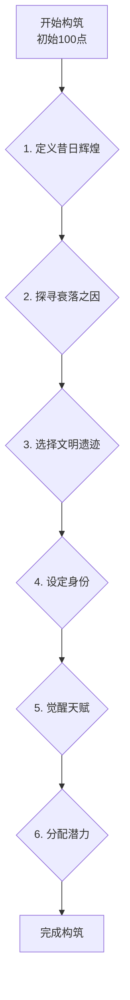

# 主世界构筑与角色诞生方案 V5 (最终版)

## 1. 核心理念

- **核心前提**: 主世界固定为“高能级跌落，超凡复苏”的背景。
- **核心机制**: 创世点数 (初始100点)，玩家的选择将消耗点数，最终剩余的点数将用于分配角色的基础潜力。
- **核心流程**: 分为“世界构筑”和“角色设定”两个阶段，引导玩家逐步完成创建。

---

## 2. 流程图

---

## 3. 详细步骤

### **阶段一：世界构筑 - “追溯历史，定义现在”**

#### **步骤 1: 定义昔日辉煌 (选择基调 - 不消耗点数)**
*   **描述**: 选择一个曾达到文明巅峰的超凡体系，这将决定您主世界的历史底色和力量体系的源头。
*   **选项**:
    1.  `[修仙文明]`: 御剑飞仙，炼丹求长生。这是一个追求个体伟力，以“气”为核心的文明。
    2.  `[魔法文明]`: 掌控元素，构建奥术奇迹。这是一个探索宇宙规律，以“知识”为核心的文明。
    3.  `[科技文明]`: 基因飞升，机械殖民星海。这是一个改造自身与环境，以“物质”为核心的文明。
    4.  `[异能文明]`: 人人皆有异能，精神干涉物质。这是一个挖掘心灵力量，以“意志”为核心的文明。
    5.  `[蒸汽朋克文明]`: 机械与蒸汽的轰鸣，差分机与飞空艇的浪漫。
    6.  `[克苏鲁神话]`: 宇宙的真相不可名状，知识本身即是疯狂的源头。
    7.  `[武道文明]`: 打破肉身极限，拳碎星辰，滴血重生。
    8.  `[神祇文明]`: 信仰汇聚成神，神明行走于大地，牧养自己的信徒。
    9.  `[妖鬼文明]`: 万物有灵，百鬼夜行，一个人类与非人共存的幽暗世界。
*   `[自定义基调]` (消耗10点)

#### **步骤 2: 探寻衰落之因 (选择1-3个世界标签 - 消耗点数)**
*   **描述**: 世界为何从辉煌走向衰落？您的选择将决定当前世界的“伤痕”与即将到来的“复苏”方向。
*   **选项**:
    1.  `[末法时代]` (消耗15点): 天地灵气/能量潮汐退去，超凡力量的“燃料”耗尽。
    2.  `[诸神黄昏]` (消耗10点): 一场灭世战争导致强者尽数陨落，传承出现断代。
    3.  `[飞升之灾]` (消耗10点): 高维通道开启，所有顶尖存在尽数离去，世界被“釜底抽薪”。
    4.  `[天道沉睡]` (消耗10点): 世界意志陷入沉睡，法则不再回应，一切超凡行为都变得困难。
    5.  `[外神入侵]` (消耗15点): 来自世界之外的不可名状之物污染了世界的根源。
    6.  `[维度折叠]` (消耗10点): 世界从高维跌落，许多法则和地域被“压缩”或“放逐”。
    7.  `[法则崩坏]` (消耗15点): 世界的基础规则变得混乱而不稳定，超凡力量极易失控。
    8.  `[知识诅咒]` (消耗10点): 某种知识或信息被证实是致命的，导致文明自我毁灭。
    9.  `[资源枯竭]` (消耗5点): 驱动文明的关键超凡资源被消耗殆尽。
    10. `[血脉断绝]` (消耗5点): 能够使用超凡力量的血脉由于某种原因断绝。
    11. `[和平之毒]` (消耗5点): 过度安逸的和平消磨了文明的进取心，导致超凡技术停滞并退化。
    12. `[机械叛乱]` (消耗10点): 拥有自我意识的机械仆从向其创造者举起了屠刀。
    13. `[自然之怒]` (消耗5点): 文明对世界的过度索取引来了世界本身的反噬。
    14. `[信仰崩塌]` (消耗10点): 神祇因信徒的遗忘而失去力量，最终消亡。
    15. `[文明内战]` (消耗5点): 内部的理念或利益冲突引发了毁灭性的内战。
    16. `[时空循环]` (消耗15点): 世界被困在一个不断重复的时间循环中，消磨着一切。
    17. `[大过滤器]` (消耗20点): 宇宙中存在一个机制，会毁灭所有发展到一定程度的文明。
    18. `[圣者离去]` (消耗5点): 守护世界的圣者或伟大存在因未知原因离去。
    19. `[凡人革命]` (消耗5点): 无法掌握超凡力量的凡人联合起来，推翻了超凡者的统治。
    20. `[乐园之梦]` (消耗10点): 整个世界陷入一个无法醒来的巨大幻境之中。
*   `[自定义原因]` (消耗10点)

#### **步骤 3: 选择文明遗迹 (选择1个主流，1个非主流 - 消耗点数)**
*   **主流文化**: 由基调决定，自动选择，不消耗点数。
*   **非主流文化**:
    1.  `[仙家洞府]` (消耗5点): 隐藏在深山中的修炼宗门遗址。
    2.  `[古代图书馆]` (消耗5点): 收藏着禁忌知识的古老图书馆。
    3.  `[上古机械都市]` (消耗5点): 埋藏于地下的巨型科技城市废墟。
    4.  `[异能者收容所]` (消耗5点): 曾用于研究和收容异能者的秘密设施。
    5.  `[巨龙之墓]` (消耗8点): 埋葬着古龙及其宝藏的巨大骸骨。
    6.  `[时空裂隙]` (消耗8点): 一个连接着未知位面的不稳定通道。
    7.  `[神明棋盘]` (消耗8点): 传说中是古神博弈留下的巨大棋盘，蕴含法则之力。
    8.  `[世界之树的根须]` (消耗10点): 贯穿位面的巨树延伸到此地的一小部分。
    9.  `[妖精的集市]` (消耗5点): 一个只在特定时间对特定人群开放的秘密集市。
    10. `[英雄的陵园]` (消耗5点): 埋葬着无数古代英雄，他们的精神依然在此徘徊。
    11. `[被遗忘的战场]` (消耗8点): 诸神黄昏的古战场，残留着强大的武器和怨念。
    12. `[深海宫殿]` (消耗8点): 沉入海底的古代文明之都。
    13. `[天空之城]` (消耗10点): 漂浮在云层之上的魔法或科技都市。
    14. `[活体工厂]` (消耗8点): 用生物技术“生长”产品的古代工厂。
    15. `[心灵网络节点]` (消耗8点): 覆盖全球的精神网络的一个物理接入点。
    16. `[旧日支配者封印地]` (消耗10点): 封印着某个古老邪物的禁区。
    17. `[时间之墟]` (消耗10点): 时间流速异常，过去、现在、未来交织的混乱之地。
    18. `[万法之源]` (消耗15点): 一个微小的奇点，泄露着纯粹的创造与毁灭之力。
    19. `[始祖之血的源头]` (消耗15点): 某个强大超凡种族的诞生之地。
    20. `[轮回之井]` (消耗15点): 传说中灵魂转生必须经过的地方。
*   `[自定义遗迹]` (消耗10点)

---

### **阶段二：角色设定 - “应运而生”**

#### **步骤 4: 设定身份 (选择1个)**
*   从20个预设身份中选择，或自定义。
*   **预设示例**:
    1.  `[古老家族的后裔]` (消耗10点): 你的血脉中流淌着昔日强者的力量。
    2.  `[废墟拾荒者]` (返还5点): 你在文明的废墟中长大，对危险有敏锐的直觉。
    3.  `[历史系学生]` (消耗5点): 你对逝去的辉煌时代有着狂热的痴迷和深入的研究。
    4.  `[网络黑客]` (消耗8点): 在数据之海中，你发现了超凡的蛛丝马迹。
    5.  `[退役士兵]` (消耗8点): 你拥有坚定的意志和丰富的战斗经验。
    6.  `[秘密社团成员]` (消耗10点): 你是一个追寻超凡力量的秘密组织的一员。
    7.  `[街头艺人]` (消耗5点): 你的艺术拥有触动人心的神秘力量。
    8.  `[急诊科医生]` (返还5点): 你看惯了生死，心境比常人更加坚韧。
    9.  `[古董店老板]` (消耗8点): 你经手的“古董”中，似乎有些是真品。
    10. `[私人侦探]` (消耗5点): 你专门调查无法用科学解释的“灵异事件”。
    11. `[无名的流浪者]` (返还10点): 你一无所有，但也因此无所畏惧。
    12. `[实验室的研究员]` (消耗10点): 你所在的实验室似乎在进行着禁忌的研究。
    13. `[心理医生]` (消耗8点): 你能洞察人心，甚至能感受到他人扭曲的梦境。
    14. `[极限运动员]` (消耗5点): 你不断挑战人类的极限，触摸到了超凡的门槛。
    15. `[图书馆管理员]` (消耗5点): 你在故纸堆中发现了被遗忘的历史。
    16. `[黑市商人]` (消耗8点): 你游走在灰色地带，交易着各种违禁品。
    17. `[神棍/算命先生]` (消耗5点): 你说的话半真半假，但有时却惊人地准确。
    18. `[大公司CEO]` (消耗15点): 你拥有巨大的财富和权力，渴望用它们换取更长的生命。
    19. `[濒死体验者]` (返还5点): 你曾在死亡的边缘徘徊，并带回了一些“东西”。
    20. `[穿越者]` (消耗20点): 你不属于这个世界，你的到来本身就是一个变数。
*   `[自定义身份]` (消耗15点)

#### **步骤 5: 觉醒天赋 (最多选择3个)**
*   从20个预设天赋中选择，或自定义。
*   **预设示例**:
    1.  `[天生灵体]` (消耗15点): 对能量的感知和亲和力远超常人。
    2.  `[过目不忘]` (消耗10点): 拥有完美的记忆力。
    3.  `[剑心通明]` (消耗15点): (修仙基调解锁) 对“剑”的领悟力超凡。
    4.  `[元素亲和]` (消耗15点): (魔法基调解锁) 你能轻易地与某种或多种元素沟通。
    5.  `[机械改造]` (消耗15点): (科技基调解锁) 你的身体能够完美地与机械融合。
    6.  `[第六感]` (消耗10点): 你对危险和机遇有野兽般的直觉。
    7.  `[百折不挠]` (消耗10点): 你的精神韧性极强，不容易被控制或击垮。
    8.  `[鸿运当头]` (消耗20点): 你的运气总是比别人好那么一点点。
    9.  `[解析之眼]` (消耗15点): 你能轻易看穿事物的本质和弱点。
    10. `[快速学习]` (消耗15点): 你的学习效率是常人的两倍。
    11. `[群众魅力]` (消耗10点): 你天生就容易获得他人的好感和信任。
    12. `[苦行僧]` (返还5点): 你对物质享受的需求极低，能忍受常人无法忍受的痛苦。
    13. `[血脉之力]` (消耗20点): 你的血脉中潜藏着某种强大的力量。
    14. `[多重人格]` (消耗5点): 你的体内住着另一个“你”，他/她或许拥有你不知道的能力。
    15. `[与非人沟通]` (消耗10点): 你能听懂动物、植物甚至鬼魂的低语。
    16. `[伪装大师]` (消耗5点): 你能轻易地模仿他人，融入任何环境。
    17. `[武器大师]` (消耗10点): 你能快速掌握任何一种武器的使用方法。
    18. `[不死小强]` (消耗20点): 你的生命力极其顽强，总能在绝境中存活下来。
    19. `[灵感迸发]` (消耗10点): 在研究或创造时，你总能获得天外飞仙般的灵感。
    20. `[赌徒]` (返还10点): 你热衷于高风险高回报的抉择，但失败的代价也同样巨大。
*   `[自定义天赋]` (消耗25点)

#### **步骤 6: 分配潜力**
*   将所有剩余的“创世点数”自由分配到 `精`、`气`、`神`、`运` 四项基础潜力上。
